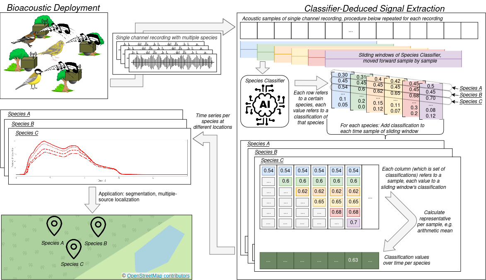
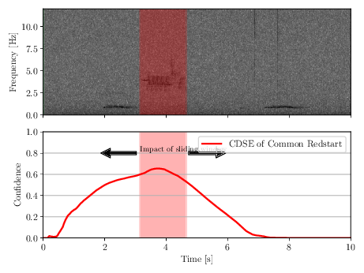
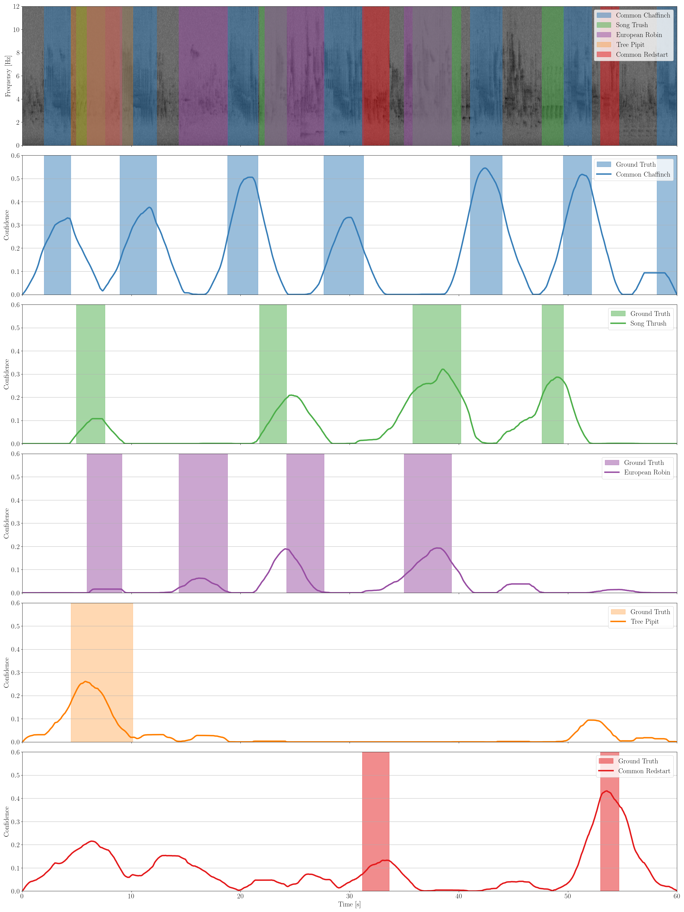

<div align="center">
  <h1>Classifier-Deduced Signal Extraction Algorithm </h1>
  <p>Automated Classifier-Deduced Signal Extraction using species classifiers such as BirdNET</p>
  
</div>

## Abstract 
With the development of reliable AI-based species classifiers and the design of low-cost autonomous recording units, acoustic monitoring has become an emerging research field. Although strides are made in automated species monitoring, automated localization remains a significant challenge. Distinguishing and pinpointing bird sounds in noisy, reverberant, and dynamic natural environments is extremely difficult, ultimately deteriorating the accuracy of time difference estimations and, consequently, localization.
In this paper, we take a significant step towards reliable automated localization by presenting a viable and generalizable approach to extracting species-dependent signals from intermixed acoustics, which we call Classifier-Deduced Signal Extraction (CDSE). These signals can be used to estimate precise time differences while retaining information for individual species. Our method seamlessly extends the current capabilities, requiring only minor modifications to state-of-the-art classifiers. We prove its applicability and usefulness by deploying it on bird acoustics using the popular bird species classifier BirdNet.

For details, please read our ([Pre-Print](https://papers.ssrn.com/sol3/papers.cfm?abstract_id=4957052)) 

## Introduction

This repo contains the CDSE algorithm and scripts for processing data used for publication.
This is the most advanced version of CDSE for acoustic analyses and we will keep this repository up-to-date and provide improved interfaces to enable scientists with no CS background to run the analysis.

Feel free to use CDSE for your acoustic analyses and research.
We will update our citation as soon as the the paper is published. For now, please cite as: 

```
@article{Bruggemann2024cdse,
  author       = {Brüggemann, Leonhard and Dyczka, Mario and Otten, Daniel and Aschenbruck, Nils},
  title        = {A Classifier-Integrated Signal Extraction Approach for Time Difference Estimation in Acoustic Sensor Networks},
  year         = {2024},
  month        = {August},
  url          = {https://ssrn.com/abstract=4957052},
  doi          = {10.2139/ssrn.4957052},
  note         = {Available at SSRN: \url{https://ssrn.com/abstract=4957052} or \url{http://dx.doi.org/10.2139/ssrn.4957052}}
}
```

## How to Use
1. Clone the repository:
    
   ```git clone https://github.com/your-username/Classifier-Deduced-Signal-Extraction-Algorithm.git```

2. Install the dependencies:

    ```pip install -r requirements.txt```

3. See in ```main.py``` the method ```main_minimal_usage_example.py```.

## Minimal Working Example

Important: BirdNET classifications refer to seconds, this approach requires to convert the seconds to samples!

1. Parse the classifications (e.g., dummy.BirdNET.results.txt) ensuring there are no gaps or duplicate rows. The data should correspond to a single species only.

```
    parser = Parser()
    parser.parse_textfile("./example_data/data/processed/classifications/dummy.BirdNET.results.txt",
                           rows_per_chunk=1440000, use_columns=None, column_names=None)
    df = parser.check_and_fill_missing_values(df=parser.data, chunk_size=144000, start_col='start', end_col='end', step=1,
                                         confidence_col='confidence', default_confidence=0.0)
```

2. Apply our approach CDSE, on the parsed data. Default aprameters refer to BirdNET v2.4.
```
    cdse = CDSE()
    cdse.set_data_from_parser(df)
    cdse_data = cdse.cdse_from_dataframe(outpath=None,
                            end_col='end',
                            audio_sampling_frequency=48000,
                            audio_max_duration=None,
                            window_size=144000,
                            confidence_threshold=0.1,
                            progress_updates=True)
```

3. Process CDSE, e.g. plotting
<div align="center">
     
</div>

## Showcase: Applied on Dawn Chorus
CDSE extracts a time series for each species, providing detailed insights into species-specific patterns. We applied this method to real dawn chorus data (as detailed in our publication), resulting in the following signals that highlight the accuracy and robustness of the approach.

<div align="center">
     
</div>

## Integrate Data used in Publication for Replication
The data used in this project have been processed using the university service. Unfortunately, the original directory structure could not be preserved. Instead, the data are provided as a split .zip archive that must be recombined (refer to the provided link for instructions).

Once the unzipped directory is available, e.g., on an external drive, it can be easily accessed by creating a symbolic link. In Linux, this can be done by executing the following command within the cloned Github repository: ln -s path/to/unzipped_dir ./data

Data available at: TBA

## Contact
For questions or issues, please contact [brueggemann@uni-osnabrueck.de].
